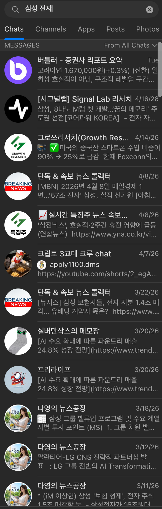
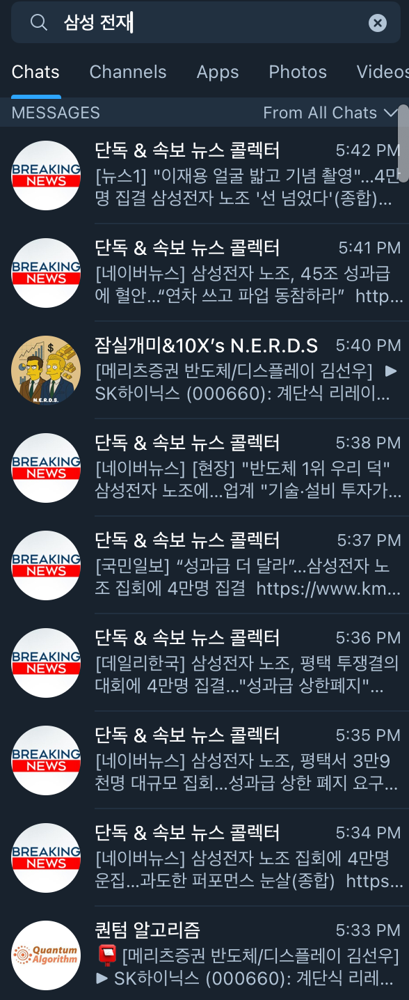

# telegram-seoyu

> macOS Telegram client with Korean-aware search and a local LLM-powered wiki

A fork of [overtake/TelegramSwift](https://github.com/overtake/TelegramSwift)
paired with a Rust sidecar that owns a Korean-aware search index. Type Korean
in the global search bar and hits from the local FTS5 index merge into the
result list alongside Telegram's native server search.

**Status:** Dev build live. Unsigned, macOS 26 arm64 only.
Latest release → **[v0.4.0-dev](https://github.com/sskys18/telegram-korean-search/releases/latest)**.

## What it fixes

Telegram's native search is English-first. Korean queries suffer in three
ways. Each one is the default behavior of the official client; Seoyu fixes
all three with a local index.

| Query                | Upstream Telegram | telegram-seoyu    |
| -------------------- | ----------------- | ----------------- |
| `삼성` (substring)    | ❌ no match       | ✅ finds `삼성전자` |
| `삼성 전자` (spacing) | ❌ no match       | ✅ finds `삼성전자` |
| `ㅅㅏㅁ` (jamo)       | ❌ no match       | ✅ finds `삼성`    |

### Same query, same moment, side by side

Query: **`삼성 전재`** (deliberate typo + whitespace). Left: Seoyu. Right: upstream TelegramSwift.

| telegram-seoyu (this project) | Upstream TelegramSwift |
| ----------------------------- | ---------------------- |
|  |  |
| Hits across **10+ channels**, dates spanning weeks. `삼성 전재` normalizes to `삼성전자` via the nospace column. | Hits only from a **single recent chat**. Spacing + typo breaks the match; server-side search returns only literal recent hits. |

## Architecture

```
┌──────────────────────────────────────────┐
│  TelegramSwift fork (AppKit, GPLv2)      │
│   ├── original chat UI, login, sync      │
│   ├── SearchController hook              │
│   └── SeoyuBridge (opens + queries       │
│       the sidecar, mirrors Postbox)      │
└─────────────────┬────────────────────────┘
                  │ FFI via `packages/Seoyu`
┌─────────────────▼────────────────────────┐
│  telegram-seoyu sidecar (Rust, MIT)      │
│   ├── SQLite mirror (messages + FTS5)    │
│   ├── Korean normalizer                  │
│   │     (trigram / jamo / nospace)       │
│   ├── search engine                      │
│   └── wiki pipeline (codex exec)         │
└──────────────────────────────────────────┘
```

Every message Postbox stores is mirrored into the sidecar's SQLite store
and indexed by FTS5 with three auxiliary columns:
`content`, `jamo` (decomposed 자모), `nospace` (whitespace-stripped). Search
fans out to all three and merges by rank. Nothing leaves the machine
except the MTProto traffic TelegramSwift already makes.

## Install (use the prebuilt dev build)

**Requirements:** macOS 26 (Tahoe) or newer, Apple Silicon.

1. Download `Telegram-seoyu.dmg` from the
   [latest release](https://github.com/sskys18/telegram-korean-search/releases/latest).
2. Mount the DMG and drag **Telegram.app** to `/Applications`.
3. Clear the quarantine attribute (required because the build is unsigned):
   ```bash
   xattr -dr com.apple.quarantine /Applications/Telegram.app
   ```
   Or right-click → **Open** → **Open** the first time.
4. Launch and sign in with your Telegram phone number as usual.

First launch takes a minute while the sidecar ingests your message history
into the local FTS index. Subsequent launches are instant.

## Build from source

**Requirements:** macOS 26.4+, Xcode 26.4+, Apple Silicon, ~10 GB free.

```bash
git clone https://github.com/sskys18/telegram-korean-search.git
cd telegram-korean-search
./scripts/build-dev.sh --run      # 15–30 min first build; launches on success
```

For a signed, distributable build, open `Telegram-Mac.xcworkspace` in Xcode
and build normally with your Developer ID team. See
[`docs/XCODE26-BLOCKER.md`](docs/XCODE26-BLOCKER.md) for the Xcode 26 Swift
driver workaround (`scripts/ld-cryptex-shim.sh`) that makes the CLI build
succeed.

### Sidecar in isolation

The Rust sidecar builds and tests standalone:

```bash
cd sidecar
cargo build --release    # produces tg-seoyu-sidecar
cargo test               # 85 tests, 1 ignored
cargo clippy -- -D warnings
cargo fmt --check
```

## Repository layout

```
Telegram-Mac/              Swift app target (upstream + Seoyu/)
Telegram-Mac/Seoyu/        SeoyuBridge + ingest observer
packages/Seoyu/            Swift wrapper over the sidecar (UniFFI)
Telegram-Mac.xcworkspace   open this in Xcode

sidecar/                   Rust crate: search, store, wiki, security
scripts/                   build-dev.sh, ld-cryptex-shim.sh, …
docs/                      handoff, blockers, design notes
```

## Data location

```
~/Library/Application Support/telegram-korean-search/
    tg-korean-search.db       SQLite + FTS5 (messages, wiki, queue)
```

Postbox data (the upstream Telegram client's store) lives under its own
directory and is untouched by the sidecar.

## Uninstall

```bash
rm -rf /Applications/Telegram.app
rm -rf ~/Library/Application\ Support/telegram-korean-search
```

Your Telegram account and server-side message history are not touched.

## Attribution

This project forks
[overtake/TelegramSwift](https://github.com/overtake/TelegramSwift). All
Swift source at the repository root, the Xcode workspace, and `submodules/`
are upstream's work, licensed under **GPLv2**. The sidecar is new code
licensed under **MIT**.

Per upstream's fork requirements:

1. Uses its own Telegram API ID (configured at first run).
2. Not called "Telegram". App and repository are `telegram-seoyu`.
3. Does not use Telegram's standard logo.
4. Follows Telegram's
   [MTProto security guidelines](https://core.telegram.org/mtproto/security_guidelines).
5. Source is public per GPLv2.

## License

- Swift shell + all upstream code: **GPLv2** ([LICENSE](LICENSE))
- `sidecar/` Rust crate: **MIT** (`sidecar/Cargo.toml`)

## Scope

Personal, local-only, macOS-only. Dev builds are unsigned. Signed
distribution requires an Apple Developer ID we do not yet have.
